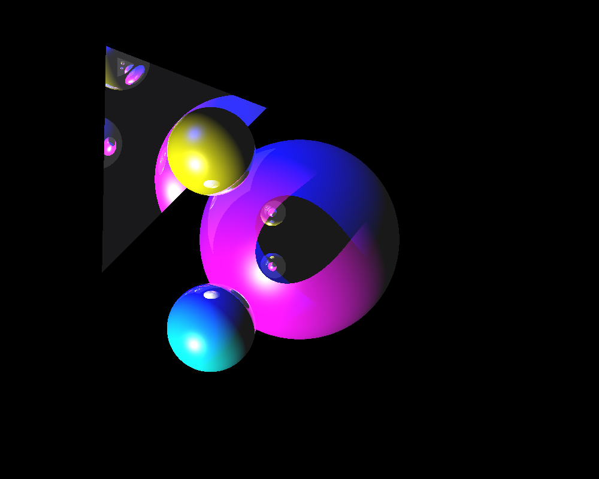

# Raytracer

Makes realistic images using rudimentary raytracing. Here is a sample.

To compile, type `make` in the command line whilst in the directory where the project is in. You don't need to do anything else.

This cannot (yet) render scenes with lots of objects in them since we didn't have a chance to implement acceleration structures.

Computer specs (try to run it on something similar if it's not working):

Mac OS Sierra, Early 2015
2.7 GHz Intel Core i5
Intel Iris Graphics 6100 1536 MB
